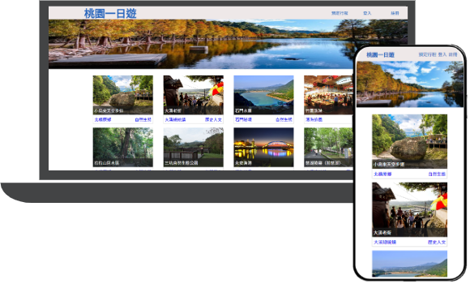
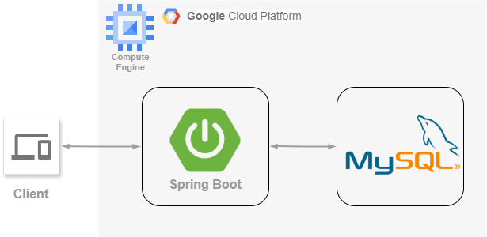

# Taouyan-Day-Trip

 
Taoyuan-Day-Trip is an e-commerce tourism website where users can find and book an one-day sightseeing itinerary in Taoyuan City, Taiwan. It offers over 70+ public scenic spots information. The application development adopts a separation of frontend and backend. Its API design use RESTful format. It uses third-party payment which is TapPay SDK to checkout your appointment.

- Website : http://35.194.190.180:8080/
- Test Account : Test123@gmail.com
- Password : test123
- Test Credit Card Infomation:
  - Credit Card number: 4242 4242 4242 4242
  - Credit Card Expiration Dates: 12/34
  - Credit Card CCV Code : 123

# Demo
- Viewing information about one-day scenic spots
- Attraction Image Carousel

  
 

- Choose & book sightseeing itinerary
- Shopping cart system
- Payment system
- History orders system

 
 

- RWD 

# Contents
- [Architecture](#architecture)
- [Backend Technique](#backend)
  - [key Points](#key-points)
  - [Deployment](#deployment)
  - [Environment/Web Framework](#environmentweb-framework)
  - [Database](#database)
  - [Networking](#networking)
  - [Version Control](#version-control)
- [Database Schema](#database-schema)
- [Frontend](#frontend)
- [API Doc](#api-doc)
- [Contact](#contact)

## Architecture

## Backend
### Key Points
- JWT authentication (using Spring Security)
- MVC pattern
- Third-party Payment Service
### Deployment
- GCP Compute Engine

### Environment/Web Framework

- Java / Spring Boot

### Database

- MySQL (using MyBatis conduct CRUD)
### Networking
- HTTP
### Version Control

- Git / GitHub

## Database Schema

### Version Control

- Git / GitHub

## Frontend Technique
- html
- css
- javascript
- Vue2.js
- RWD

## Third-Party  Library
- Google Map API
- axios

## API Doc

- [API Doc](https://app.swaggerhub.com/apis-docs/jerryli-ffe/Taoyuan-Day-Trip/1.0.0#/)

## Contact

👨🏻‍💻 Jian-Hung, Li
 

📬 E-mail : onigiri821130@gmail.com